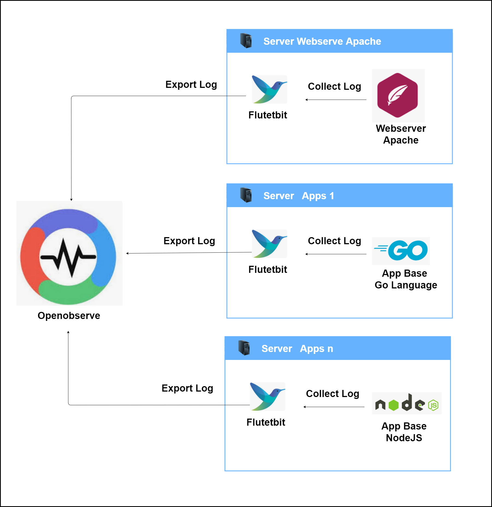
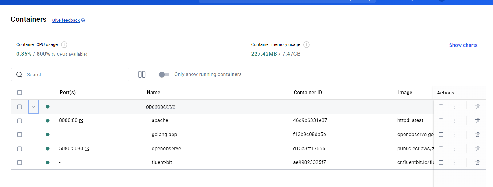
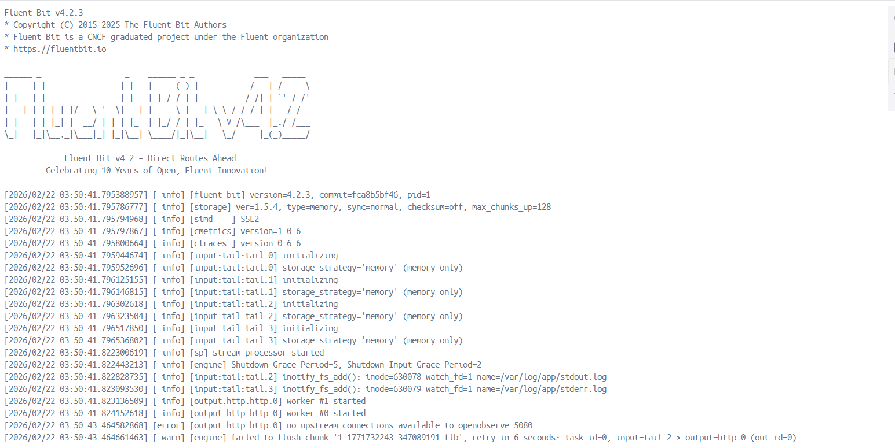
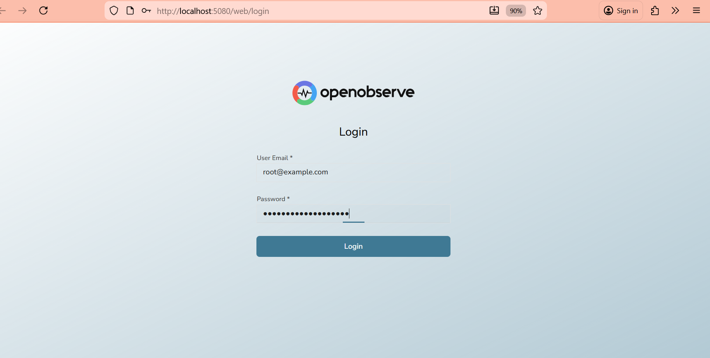
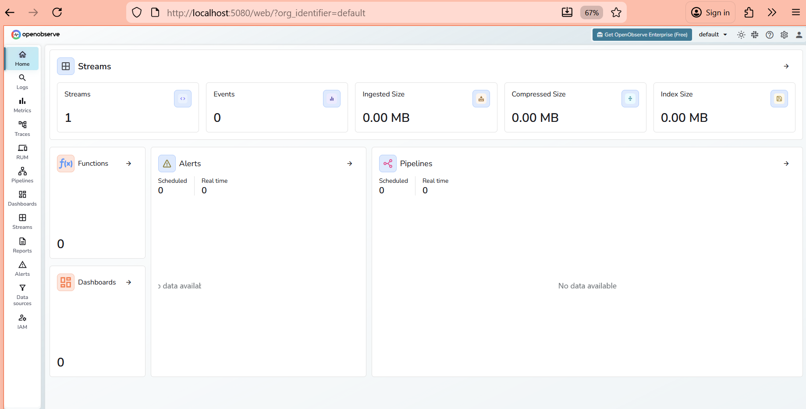
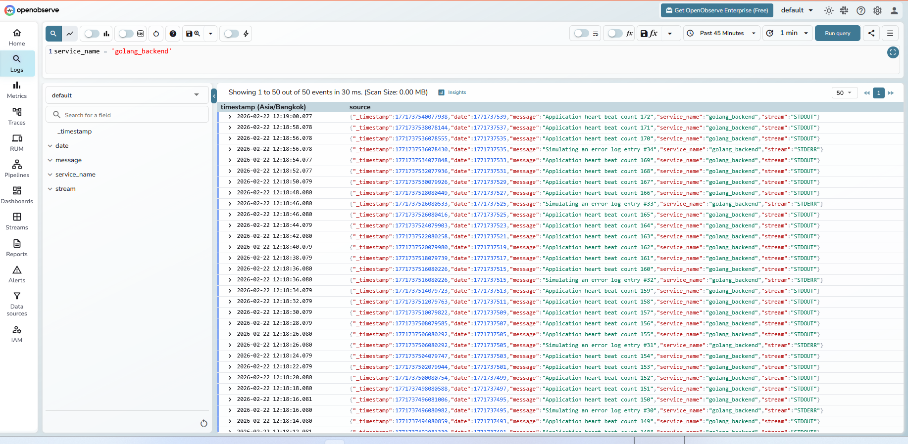
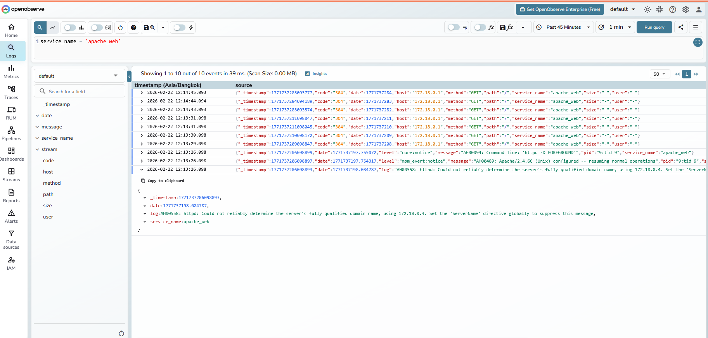
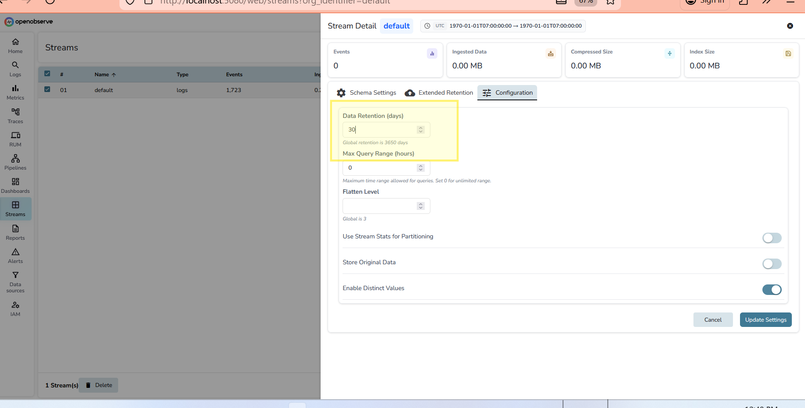

# 🚀 OpenObserve: The Super Diary for Apps!

Have you ever wondered what happens inside a computer program when it's running? Or how engineers find out why a website crashed? Welcome to the world of **Observability**!

Connecting Fluent Bit and OpenObserve you no longer need to log into each VM or Container individually via terminal, just to find the cause of an error. You simply need to open a single Dashboard to monitor system in real-time 

## 📖 Table of Contents
1. [The Story: Why do we need logs?](#1-the-story-why-do-we-need-logs)
2. [What is Observability?](#2-what-is-observability)
3. [What are Logs?](#3-what-are-logs)
4. [What is OpenObserve?](#4-what-is-openobserve)
5. [What is Fluent Bit?](#5-what-is-fluent-bit)
6. [Architecture](#6-architecture)
7. [How to See it Working](#7-how-to-see-it-working)
8. [Default Login](#8-default-login)

## 1. The Story: Why do we need logs?

Imagine you have a pet cat named "Go-App". One day, you come home and find a vase broken on the floor. Go-App is sitting in the corner looking innocent. 

How do you know what happened? 
- Did the cat jump on the table?
- Did a gust of wind blow it over?
- Did a ghost do it? 👻

If you had a **security camera** or a **diary** where Go-App wrote down everything it did every minute, you could just read it!
*   *10:00 AM - I ate my food.*
*   *10:15 AM - I saw a bird.*
*   *10:30 AM - I jumped on the table and OOPS! The vase fell.*

In the world of computers, apps are like that cat. When something breaks, we need their "diary" to see what they were doing right before the accident. This is called **Audit** and **Troubleshooting**.

## 2. What is Observability?

Observability is a big word that just means "knowing what's going on inside." It usually has three main tools:

1.  **Metrics**: Like a thermometer. It tells you the *numbers* (e.g., "The CPU is at 90% heat!").
2.  **Traces**: Like a map. It shows the *journey* of a request (e.g., "The user clicked 'Buy', it went to the bank, then back to the shop").
3.  **Logs**: Like a diary. It tells the *story* of what happened at a specific time.

## 3. What are Logs?

Logs are simple text messages that an application sends out while it works. 
- "Starting the server..."
- "User 'Budi' logged in."
- "ERROR: Cannot find the database!"

Without logs, fixing a computer problem is like trying to solve a mystery in total darkness.

## 4. What is OpenObserve?

**OpenObserve** is like a giant, super-fast library for all those diaries (logs). 

Imagine if 100 cats (apps) were all writing diaries at the same time. You would need a place to put them all so you can search through them easily. OpenObserve lets you:
- Store millions of log lines.
- Search for specific words like "ERROR".
- Draw pretty charts to see when your app is busiest.

## 5. What is Fluent Bit?

If OpenObserve is the **Library**, then **Fluent Bit** is the **Delivery Guy**.

Fluent Bit stays on the computer where the apps are running. It watches the logs, picks them up, and delivers them safely to the OpenObserve library. It's very small, very fast, and never gets tired!

## 6. Architecture

Here is how everything is connected:

## 7. How to See it Working

We use **Docker Compose** to start everything at once. It's like pressing one "START" button for a whole factory.

### 7.1. Starting the Factory
When you run the command, you will see all the containers starting up:

### 7.2. The Delivery Guy at Work
Fluent Bit starts collecting logs from Apache (Web Server) and our Go App:

### 7.3. Entering the Library
This is the OpenObserve Home Screen. It's clean and ready for us:

### 7.4. Searching the Diaries
Inside the dashboard, we can see how many logs we have:

### 7.5. Seeing the Go App Logs
Our "Go-App" is sending heartbeats every few seconds. We can see them here:

### 7.6. Seeing the Web Server Logs
Setting rettention data 

### 7.7. Data Retention
Even the Apache web server logs are visible!

## 8. Default Login

To enter the OpenObserve library, use these keys:

*   **Email:** `root@example.com`
*   **Password:** `ComplexPassword123!`

